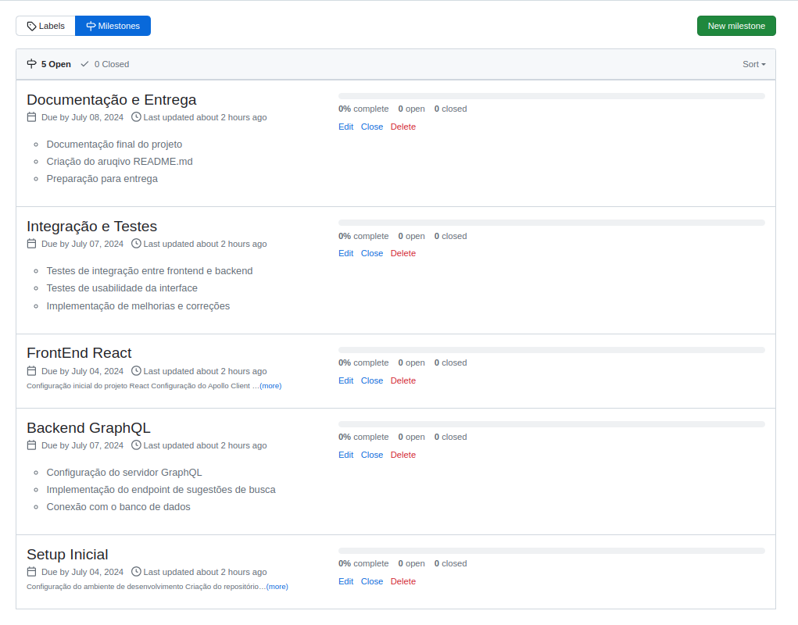
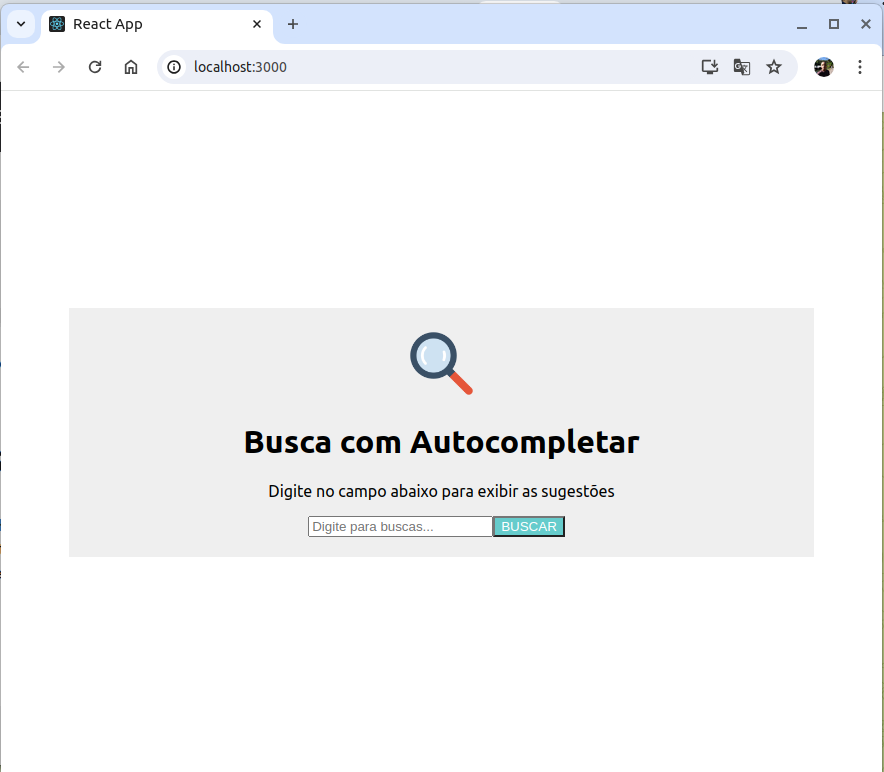
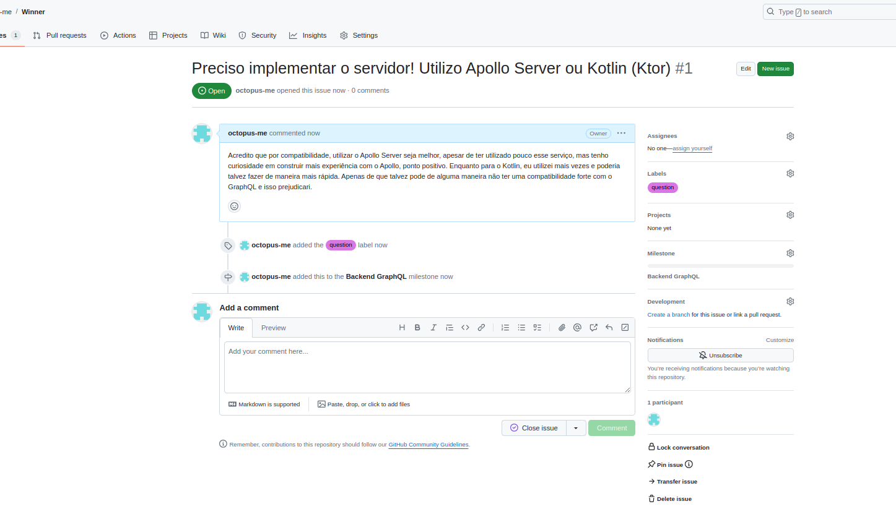
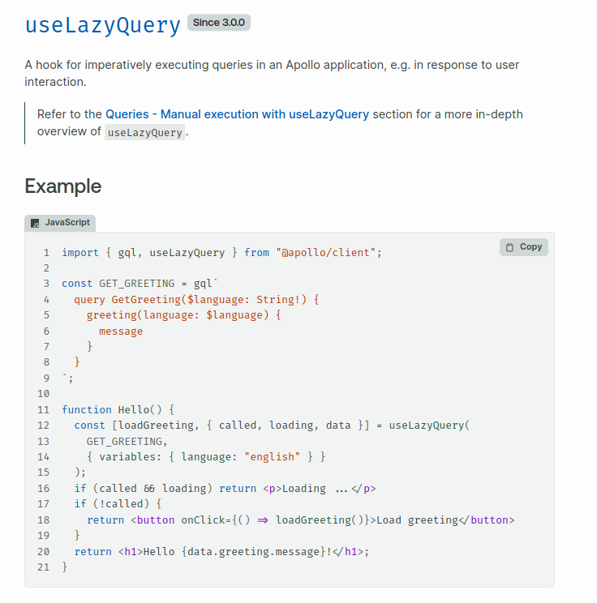
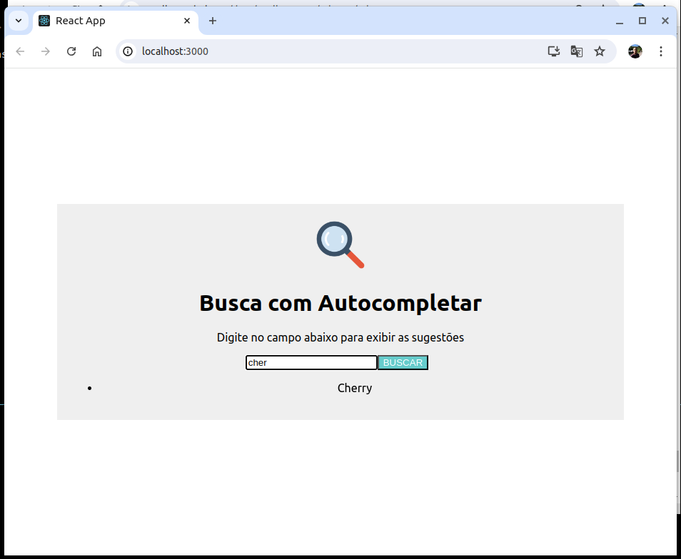
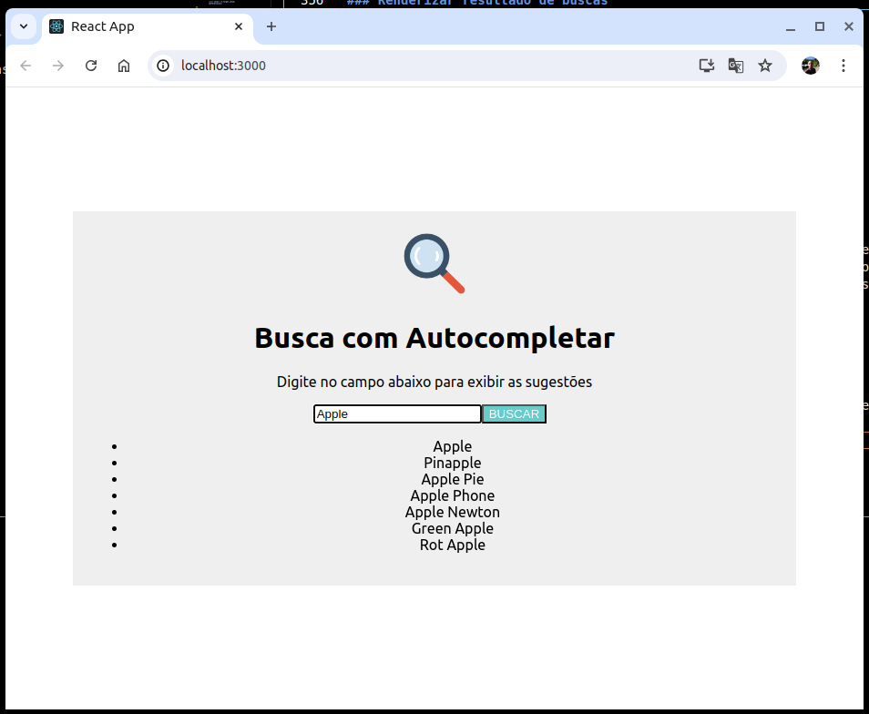
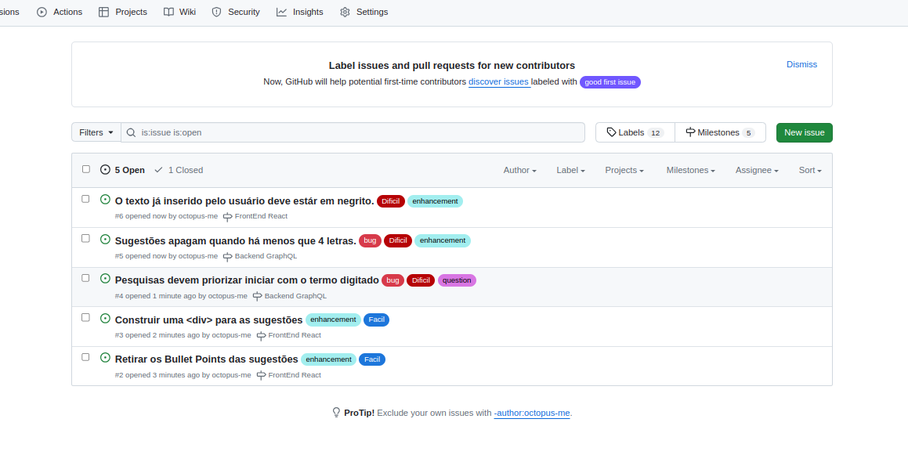
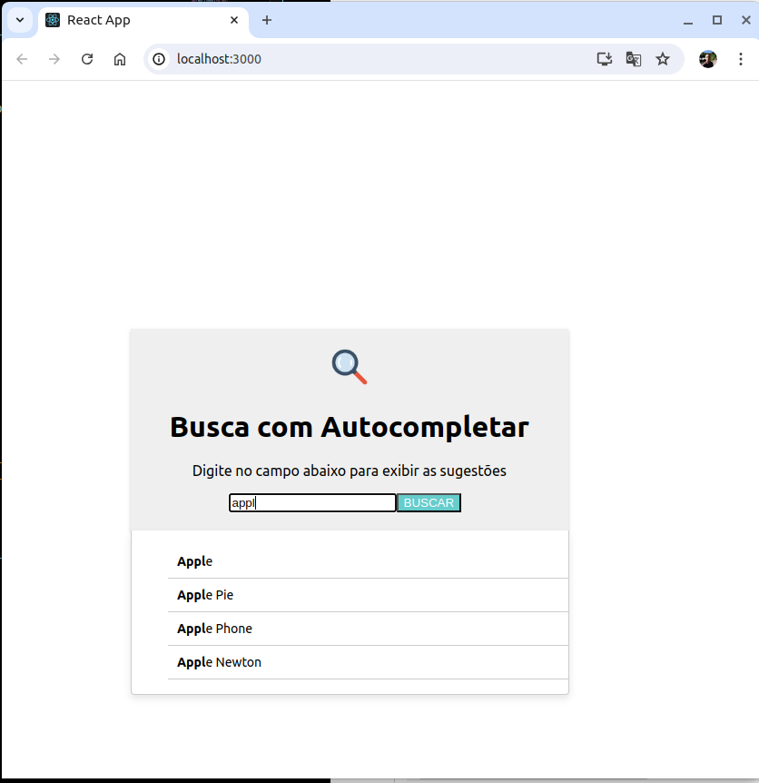
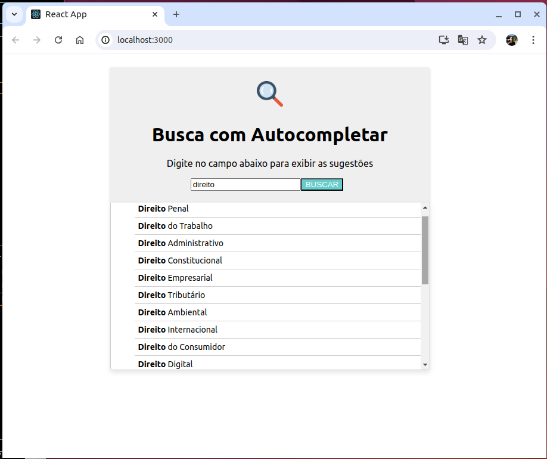

# Histórico do projeto
Aqui informarei o processo de desenvolvimento do projeto.

## Ler o enunciado

Como primeira etapa, irei ler o enunciado e anotar as informações importantes e verificar de maneira preliminar o que precisarei fazer.

- O projeto trata-se de a implementação de uma funcionalidade de auto-completar uma busca;
- Este repositório no Github vai ser utilizado para controle de versionamento do projeto e este que será entregue
- Deve funcionar no **Ubuntu** ou no **Mac OS**
- Vou precisar criar um arquivo YAML que vai ser executado com o comando '**docker-compose up**'
- O front-end vou usar o React
- GraphQL pra fazer requisições ao back-end/seridor/banco de dados
- Estou livre para escoher linguagem de back-end.


**REQUISITOS**

### Busca

- Pelo menos um campo para o usuário preencher o que deseja
- A interface gráfica é livre
- Posso definir um título para a busca ou placeholder
- Atenção: precisa ter uma boa exibição em aplicativos móveis

### Sugestões do Autocompletar

- Sugestões começam a ser exibidas após digitar o 4º dígito
- Em caso de não existir sugestãom nada é exibido
- Backend retorno no máximo 20 sugestões
- Porém, apenas 10 são exibidas
- O usuário deve poder rolar para ver mais sugestões
- A parte que o usuário já digitou fica em negrito
- Na ação de hover ou touch a sugestão é destacada
- Sugestões mudam conforme usuário digita
- Velocidade
- Após o clique, o campo é preenchido com o valor sugerido

### Lista de Sugestões / Persistência
- O BD pode ser populado com as sugestões (de maneira automatizada)
- Ou, poderei te rum arquivo com as sugestões em um arquivo

**AVALIAÇÃO DO DESAFIO**
- Atender as funcionalidades de auto-completar uma busca
- Qualidade do código é importante
- Facilidade de executar o projeto

## Inicio
O sistema Operacional que utilizarei para o desenvolvimento é:
**Ubuntu 22.04.4 LTS**

O navegador principal que utilizarei será
**Google Chrome**

Inicialmente irei fazer uma atualização do sistema e conferir as dependências que provavelmente precisarei no projeto.

```
sudo apt update
sudo apt upgrade
```

E as dependências que tenho instalados no sistema são
- NodeJS [ v20.9.0 ]
- Docker [version 27.0.3, build 7d4bcd8]
- Docker Compose [version v2.3.3]
- React [^18.3.1]
- GraphQL [^16.9.0]
- Apollo Server

## Milestones

Irei utilizar os serviços de issues e milestones do github para me guiar nas atividades e prazos. 



## Iniciar o FRONT END
Já pondo a mão na massa. Vou criar um projeto react com o comando:

```
npx create-react-app search_autocomplete
```

Para gerenciar os pacotes padrões do Node.js vou instalar no projeto o **npm** (Node Package manager) utilizando o comando abaixo:

```npm install``` 

Vou precisar de algo para poder de um ferramenta para gerir os dados do GraphQL e do próprio GraphQL, então no diretório search_complete irei executar o comando 

```
npm install @apollo/client graphql
```
Minha linha de pensamento para a construção da interface:
- Vou construir uma interface simples e com pouco detalhe gráfico. 
- Quero um interface intuitiva e agradável para a vista
- Os gráficos precisam ser responsivos, se adaptar ao tamanho de tela quando o usuário minimizar a tela
- Além disso, precisa ter uma boa visualização em interface mobile
- Preciso garantir que o funcionamento se estenderá a demais navegadores (Mozilla, Explorer, Safari, Edge, etc...)
- No ramo do código, valorizo muito organização e limpeza do código, acredito que o código precisa ser facilmente entendível
- No React irei criar um diretorio chamado Pages
- Nesse diretório Pages criarei dois arquivos, o primeiro Search.js, que representará o componente  de busca. E o Search.module.css, para os estilos.

### Search.js

Para iniciar o este será o primeiro componente que irei gerar. Retornando as frases básicas que estarão presentes na versão final;

```
function Search(){
    return (
        <h1>Busca com Autocompletar</h1>
        <p>Digite no campo abaixo para exibir as sugestões</p>
        <button>BUSCAR<button>
    )
}
```

### Search.module.css

Para os estilos do projeto, quero uma cor para o background cinza. A tela vai ter um painel representando o componente de busca, com as elementos presentes no componente Search. Esse painel deve ficar centralizado na tela e ser responsivo e se adapatar ao tamanho de tela.

Vou criar um seletor de classe **.search{}** para que eu possa setar a cor de fundo, o alinhamento, o espaçamento interno.

Assim, cheguei ao seguinte seletor

```
.search {
    background-color: #efefef;
    max-width: 100%;
    width: 80%;
    text-align: center;
    padding: 20px;
}
```

Inserir um imagem de uma lupa pois ela me remete a busca. Como a imagem é muito grande, precisei limitar a sua largura a 10%.

```
.search img{
    width: 10%;
}
```

Além disso, tenho o estilo para o **botão**. Desejo um botão com um cor diferente chamativa e que remeta levemente a cor da lupa acima. Quando o usuário passar com o mouse por cima do botão, ele deve mudar de cor para um azul mais escuro e o cursor do mouse deve mudar para "pointer" dando assim uma ideia de clique. 

```
button {
    background-color: #66cccc;
    color: #ffffff;
    margin-right: 10px;
}

button:hover{
    background-color: #2d2296;
    cursor: pointer;
}
```

Muita dessas alterações de estilo dependem da estilização do componente pai, como por exemplo a centralização da tela. Logo, eu vou precisar modificar o arquivo **App.css**. Observação que esse arquivo já vem criado quando rodamos o comando npx, porém apaguei ele completamente e criarei novamente na maneira que quero.

```
header {
  display: flex;
  justify-content: center;
  align-items: center;
  height: 100vh;
}

```

E esse é o resultado final da interface:




## Configuração do GRAPHQL

Tenho conhecimento básico em GraphQL, os projetos que trabalhei faziam conexão com a API através de REST interfaces. Porém, eu fiquei muito animado com o fato de poder desenvolver esse projeto em GRAPHQL pois isso significa que irei aprender algo novo.

Eu assisti um Playlist de videos no YouTube sobre GraphQL e a documentação no site oficial e tomei uma noção sobre a ferramenta. O restante vou pegando conforme for aparecendo a nescessidade.

Eu percebo que vou precisar de um **cliente** que vai fazer requisições de sugestões para um **servidor**.

O **cliente** vai ser alguma implementação que vai estar presente no **Search.js** utilizando o **GraphQL** conforme definido no enunciado.

Para o **servidor** das sugestões, eu poderei implementar de maneira mais livre. Eu consigo imaginar utilizar um ferramenta que tenho menor familiaridade mas muito interesse em aprender que seria o ApolloServer. Ou algo que tenho mais familiaridade que seria implementar um servidor em Kotlin com uso do framework Ktor. Vou chegar a conclusão dessa dúvida em sequência. Para isso, inicializarei uma issue no GitHub para indicar essa decisão que deve ser feita por mim.



### GraphQL Client (React)

Vendo na documentação no site do Apollo Graph QL tem alguns exemplos que demonstram como será uma implementação de Query (pesquisa) em um servidor GraphQL.



Com isso, sugere que precisarei de uma GraphQL query no seguinte formato aproximadamente:

```
const GET_SUGGESTIONS = gql`
    query GetSuggestions($searchTerm: String!){
        suggestions(language: $searchTerm){
            suggestion
        }
    }
`
```

Na função do componente **Search.js** irei então fazer a chamada desse médoto **useLazyQuery** em que retona em si uma tupla. De acordo com o que está escrito no manual e baseado também no código exemplo, o médoto useLazyQuery recebe uma GraphQL query e retorna uma tupla, na qual o primeiro elemento é um função de query que poderei usar posteriormente no código e o segundo elemento é o mesmo elemento retornado pela função "useQuery". Essa ultima parte dificultou um pouco, vou precisar conferir o que seria o retorno do médoto useQuery.

Ainda de acordo com a documentação, o retorno é um ojeto do Apollo Cleinte que contein as propriedades "loading", "error" e "data" que poderemos usar para renderizar a interface do usuário. OKAYYYYYY.


### Construindo o GraphQL Client (React)

O esquema vai ser o sequinte:

- Vou usar a função useLazyQuery conforme definido na documentação e criarei uma função chamada **getSuggestions**.
- O usuário vai digitar no campo de busca um valor
- O estado de uma variável vai ser atualizado.
- Enquanto isso, o código vai ficar chamando uma função a cad letra que o usuário insere.
- Essa função atualiza os estados.
- Como as sugestões devem aparecer somente apos a 4ª letra, colocarei uma condicional para garantir.
- Após a 4ª letra chamarei a função de Query criada pelo useLazyQuery.

Assim, atualizando a Search.js chegamos no seguinte:

```
function Search(){
    const [term, setTerm] = useState(''); // Para atualização de estados
    const [getSuggestions, {loading, data}] = useLazyQuery(ALGUMA QUERY GRAPH QL)

    return(
        <div className={style.search}>
            </img>
            <h1>Busca com Autocompletar</h1>
            <p>Digite no campo abaixo para exibir as sugestões</p>
            
            <input 
                type="text" 
                placeholder='Digite para buscas...' 
                value={term} 
                onChange={handleInputChange}>
            </input>

            <button>BUSCAR</button>
        </div>
    )
}
```

Agora preciso de um esquema para criar a GRAPH QL query que vai ser utilizada. 

```
const GET_SUGGESTIONS = gql`
    query GetSuggestions(
        $searchTerm: String!
    ){
        suggestions(term: $searchTerm){
            id
            suggestion
        }
    }
`;
```

Onde essa suggestions(term: $searchTerm) vai ser uma query que iremos definir quando formos cosntruir um servidor e ela ira retornar uma sugestão que possui esses elemetnos id e suggestion.


## Servidor

Chegou o momento de focarmos na issua criada.

Eu vi na internet alguns exemplos de servidores criados com o Apollo Server e achei ele intuitivo, então para esse projeto inicialmetne começarei utilizando o Apollo-GraphQL-server.

O fluxo que executei nessa etapa foi o seguinte:

- Criar um diretório para abrigar o Servidor/BackEnd. Nomeiei esse diretório de graphql-server
- Inicializar o novo projeto Node.js 
```npm init -y```
- Instalar as dependenciar nescessárias
```npm install apollo-server graphql```
- Terei uma lista de sugestões no formato JSON;
- Pelo manual no site, eu vou seguir essa ordem, primeiro definir o **schema** em sequencia o **Resolvers**, além disso incluir a lista de sugestões tbm nesse servidor.

### Definir o schema

De maneira bem enxuta, vou adotar um tipo sugestão, que possui um ID e uma String que vai representar a sugestão que será buscada.

Em sequência, não posso esquecer que no Search.js eu coloquei o retorno da busca como sendo o retorno da Quere **suggestions**. Logo, aqui eu também precisarei definir essa Query.

Assim, esse foi o resultado:

```
const typeDefs = gql`
  type Suggestion {
    id: ID!
    suggestion: String!
  }

  type Query {
    suggestions(term: String!): [Suggestion]
  }
`;
```

### Definir o Resolvers

Aqui vou escrever as minhas funções definidas no Schema, que nesse caso é apenas a suggestions.

Ainda apelando para a simplicidade, 
Ainda apelando para simplicidade, tenho aqui que escrever a função suggestions. Em poucas linhas e de maneira simples, a lógica é a sequinte:

- Vamos receber o termo repassado
- Caso o tamanho desse termo seja menor que 4, retornamos uma lista vazia
- Em outro caso, faremos uma filtragem utilizando uma expressão lógica.
- A lista final terá no máximo 20 elementos, logo faremos um 'slice' na lista.

```
const resolvers = {
  Query: {
    suggestions: (_, { term }) => {
        if(term.length < 4) {
            return [];
        }
        return suggestionsData.filter(suggestion =>
            suggestion.suggestion.toLowerCase().includes(term.toLowerCase())
        ).slice(0,20);
    },
  },
};

```


### Lista de Sugestões

Aqui tbm temos a possibilidade de definir uma lista de sugestões

```
const suggestionsData = [
  { id: '1', suggestion: 'Apple' },
  { id: '2', suggestion: 'Banana' },
  { id: '3', suggestion: 'Cherry' },
  { id: '4', suggestion: 'Date' },
  { id: '5', suggestion: 'Elderberry' },
  { id: '6', suggestion: 'Pinapple' },
  { id: '7', suggestion: 'Unstoppable'},
  { id: '8', suggestion: 'Strong'}
];
```

E assim construímos um servidor!

## Autocomplete de Buscas

Com isso, já temos algo para fazer o autocomplete de buscas. 

### Renderizar resultado de buscas

Mas antes disso, precisamos renderizar as buscas para mostrar na tela. 

Lembra logo acima que eu falei que a função "useLazyQuery" retorna as propriedades "loading", "error" e "data". Iremos utilizá-las para renderizar as mensagens. A sequencia abaixo de Javascrip fará a tarefa.

- Para o caso em que a pesquisa está carregando
```
{loading && (<p>Carregando...<p>)}
```

- Para o caso em que foi encontrado uma sugestão

```
{data && (
    <ul>
    {data.suggestions.map((suggestion) => (
        <li key={suggestion.id}>{suggestion.suggestion}</li>
    ))}
    </ul>
)}
```

### Enfim, vamos fazer buscas

Sei que estou ansioso para ver essa coisa funcionando haha, mas antes quero fazer uma pausa para dar um leve organizada no código do componente Search.js. A parte de renderização irei colocá-lo em um função javascript e assim terei um código mais modularizado e legível.

Agora, vamos começar a fazer as buscas



Como podemos ver na imagem acima, o sistema de busca já retorna sugestões!



Por essa outra imagem vemos o caso em que existem mais opções.

Vimos que consegui evoluir bem rápido para esse resultao, estou muito feliz e orgulhoso. Mas claramente ainda tem algumas coisas que precisam melhorar, vamos as issues!!!

ISSUES
- Retirar os Bullet Points das sugestões
- Construir um div específica para as sugestões para não dividir espaço com o painel de pesquisa
- Na pesquisa de Apple a palavra Pinaple não deveria aparecer
- BUG: Quando apago letras e finalmente ficam menos que 4 letras, as sugestões não apagam. Elas devem apagar.
- O texto já inserido pelo usuário deve estár em negrito.

Issues inseridas no GitHub, vou trabalhar uma por uma e melhorar o resultado.

.


### Reavaliação do Projeto

Ufa! Tenho já bastante coisa feita! 

Acho interessante nesse momento dar uma nova olhada nas constrains da entrega, ler novamente o enunciado, pensar em novas ideias e conferir se estou seguindo de fato o que foi proposto.

Vou então reler o enunciado, caso surja alguma dúvida ou eu tenha feito alguma coisa não como esperado tenho tempo para refazer e retirar dúvidas com o avaliador.

### Resolução de Issues

Consegui nesse tempo resolver algumas issues.

- Sobre o fato de que as sugestões não estavam apagando quando ficava com menos de 3 letras, eu percebi que havia uma condicional duplicada e que ela estava impedindo de o frontEnd chamar o back end e limpar a lista de sugestões. Corrigi e agora está funcionando.
- Sobre o fato de as sugestões estarem pegando qualquer valor que contenha o termo digitado, ao inves de selecionar apenas aqueles que iniciam com o termo. Eu precisei modificar a funçãoq que eu estava utilizando, de include() para startWith() e com isso começou a funcionar como esperado.
- Construí uma <div> específica para as sugestões e apliquei estilos me inspirando no modelo de sugestões de pesquisa do google.
- Mais um issue de estilização foi a retirada dos bullet points.


### Issue: A parte da sugestão que corresponde ao termo digitado fica em negrito

Dentre as issues inseridas, essa acabou sendo a que me causou levemente mais dificuldade. Mas consegui um solução simples e 'clean' para esse problema.

Basicamente, ao invez de mandar o retorno da renderização direta, eu mando a suggestion para uma função que criei **initialPartBold()** essa função separa a sugestão em duas strings, a primeira que corresponde ao termo digitado e o segundo que corresponde ao restante da string.

Retorno um JSX com dois elementos, o primeiro com o template "< strong >" para indicar que está em negrito e o segundo vazio. Assim, temos a versão praticamente finalizada do painel de pesquisa.

.

### Conferir a saída na interface mobile

Para testar a saída do front end na interface mobile vou acessar o endereço IP da máquina em que estou testando e acessar a porta 3000 através do navegador do meu celular e ver como fica a saída.

Consegui acessa pelo celular. Entretanto, tive apenas um difucldade quanto ao tamanho da barra de sugestões na interface web. Ou seja, não estar tão bom assim para a interface mobile. Vamos iniciar um issue!

- O problema que estou tendo refere-se ao fato de que defini um tamanho para a barra de sugestões em torno de 500px e isso acaba fazendo com que ele não se adeque tão bem ao modelo móvel.
- Estou com dificuldades, pois as ideias que estou tendo resolve um dos problemas e causa problemas no outro. Preciso encontrar algo que resolva tanto a parte móvel, quanto a parte web.

Eureka!!

Uma solução que funcionou e consegui uma boa apresentação foi a de definir a max-width em 540px, isso faz com que o painel ocupe a largura inteira da tela mobile sem espaço e fique centralizado na modalidade web. E setar a width em 100% fazendo com que o valor máximo ocupado na interface web seja exatamente igual a 540px, não mais do que isso. Isso resolver o problema!!! Ufa!!

## Banco de Dados com as sugestões

Separei o diretório do servidor e coloquei como o backend.

Criei um arquivo JSON com 300 sugestões. Todas elas relacionadas ao setor jurídico!

## Issue

Preciso garantir que vai aparecer apenas 10 elementos e os próximso vai precisar rolar para baixo. 

Assim, para adicionar **scroll** podemos utilizar no seletor .suggestios no CSS:
```
overflow-y: scroll
```
Além disso, precisamos definir uma altura máxima para que apenas 10 elementos aparecem e o resto precisaremos fazer o scroll.

Então, como definimos a font como tendo 14px de altura e 6px de padding e 1px para a borda, podemos definir uma altura máxima de 10*(14+6+6+1) = 270px. Colocando em torno de 10px de folga, teremos 280px de altura máxima, isso vai ser suficiente para aparecer 10 elementos de cada vez.

.

## Proximas etapas

O projeto está praticamente finalizado! Boa parte das funcionalidades principais já estão implementadas, faltam alguns detalhes e algumas pequenas coisas. Logo, para entregar o projeto ainda hoje, vou determinar uma lista de issues que preciso fazer para poder entregar.

- Quando o usuário clicar na sugestão, o campo da busca precisa ser preenchido com o valor
- Escrever o README
- Preparar a versão de entregar
- Impletar testes de integração entre o FrontEnd e o BackEnd e fazer correções

## A última issue???


Sobre a issue de quando o usuário clicar preencher o espaço.

Essa issue tá me dando problema kkkk. Acontece que a maneira que estou apresentando as sugestões é um elemento não interativo. Logo, eu não posso interir um event_listener. Estou pensando como eu poderia fazer isso.

A minha ideia inicial será de alguma maneira interir algum elemento interativo nessa lista, tipo um < button>. Vou tentar e ver se isso funciona.


```
    function renderSuggestions() {
        if (loading) {
            return <p>Carregando...</p>;
        }

        initialPartBold();
    
        if (data) {
            return (
                <ul className={style.list}>
                    {data.suggestions.map((suggestion) => (
                        <li key={suggestion.id}>
                            <button
                                className={style.suggestionButton}
                                onClick={() => handleSuggestionClick(suggestion.suggestion)}
                            >
                                {initialPartBold(suggestion.suggestion)}
                            </button>
                        </li>
                    ))}
                </ul>
            );
        }

        return null;
    }

```

Então, eu coloquei um evendo de botão dentro da lista, mas ainda assim não parece funcionar.


PEÇO perdão!! Essa ideia de colocar um botão é genial, mas eu percebi que não está funcionando devido que eu estou rodando no localhost uma outra aplicação, não essa modificada. Então, agora vai dar certo !!

Tudo certo agora!

