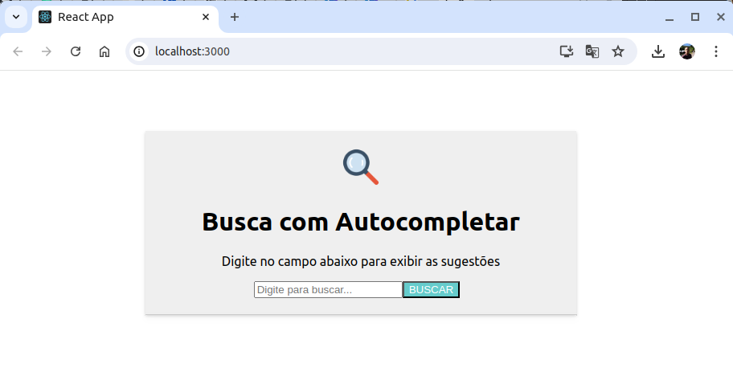
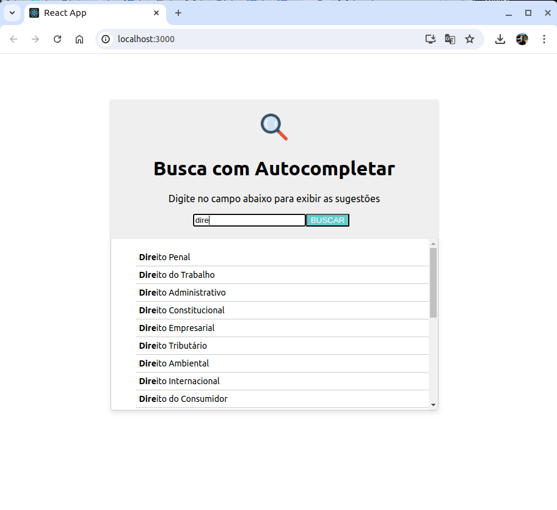

# Desafio: Autocompletar na Busca

Desafio técnico para uma vaga.

Consiste em uma interface de busca que oferece sugestões ao usuário para completar a pesquisa.


.


## Autor

- Guilherme Wallace - [@octopus-me](https://github.com/octopus-me)


## Tecnologias utilizadas

**Cliente:** 
- **React**: Utilizado para construir a interface do usuário, aproveitando sua eficiência e modularidade na criação de componentes.
- **Apollo Client**: Para gerenciar as queries do GraphQL, facilitando a comunicação entre o frontend e o backend.
- **CSS Modules**: Para o escopo de estilo local, garantindo que os estilos sejam aplicados apenas aos componentes específicos sem conflitos globais.
- **HTML/CSS**: Estrutura e estilização básica da aplicação.
- **JavaScript**: A linguagem principal para desenvolvimento do frontend.

**Servidor:** 
- **Apollo Server**: Utilizado para criar o servidor GraphQL, fornecendo uma interface para consultas, facilitando a comunicação com o frontend.
- **Node.js**: Plataforma de execução de JavaScript no servidor, escolhida por sua eficiência e suporte a grandes volumes de requisições.
- **Docker**: Utilizado para containerizar a aplicação, garantindo um ambiente de desenvolvimento e produção consistente.

## Instalação

### Pré-requisitos

Certifique-se de ter o Docker e o Docker Compose instalados na sua máquina.

- **Docker**: [Instruções de Instalação do Docker](https://docs.docker.com/get-docker/)
- **Docker Compose**: [Instruções de Instalação do Docker Compose](https://docs.docker.com/compose/install/)

### Passo 1: Clonar o Repositório

Clone este repositório para sua máquina local usando o seguinte comando:

```sh
git clone https://github.com/octopus-me/Winner.git
```

### Passo 2: Navegue até o Diretório do Projeto

Entre no diretório do projeto:

```sh
cd ./Caminho/ate/repositorio/Winner
```

### Passo 3: Construir e Executar o Projeto

Construa e inicie os containers Docker usando o Docker Compose:

```sh
docker-compose up --build
```

Este comando irá:

- Construir as imagens Docker para o frontend e o backend
- Iniciar os conteiners para o frontend e o backend

### Passo 4: Acessar a Aplicação

Após executar o comando acima, você pode acessar a aplicação no seu navegador:

- **Frontend**: http://localhost:3000
- **GraphQL Playground** (se disponível): http://localhost:4000/graphql


### Observações

- Certifique-se de que as portas 3000 (para o frontend) e 4000 (para o backend) não estejam em uso por outros serviços.
## Características

- Autocompletar inteligente: Sugestões são exibidas dinamicamente à medida que o usuário digita, a partir de 4 caracteres.
- Destaque de termos: Parte do termo que corresponde à busca inicial é exibida em negrito nas sugestões.
- Desempenho otimizado: Sugestões são carregadas rapidamente para uma experiência de usuário fluida.
- Responsividade: A interface é otimizada para funcionar em diferentes tamanhos de tela, incluindo dispositivos móveis.
- Scroll em sugestões: Apenas 10 sugestões são exibidas inicialmente, com a possibilidade de scroll para visualizar até 20 sugestões.

## Prints

.

.

## Lições Aprendidas

### Resumo Geral

Desenvolver este projeto de autocompletar foi uma experiência enriquecedora que me permitiu aprofundar meu conhecimento em várias tecnologias e práticas de desenvolvimento. 

### Principais Lições Aprendidas

1. **GraphQL e Apollo Client**
   - Antes deste projeto, eu tinha conhecimento limitado sobre GraphQL. Ao implementar a comunicação entre o frontend e o backend usando GraphQL e Apollo Client, aprendi como definir queries, além de gerenciar o estado da aplicação com o Apollo Client.

2. **React**
   - Embora eu já tivesse um conhecimento React, este projeto me permitiu explorar mais a fundo os hooks, como `useState` e `useLazyQuery`, e a implementação de componentes funcionais. Também aprendi a importância de organizar o código de forma modular e reutilizável.

3. **Docker**
   - Aprender a containerizar a aplicação com Docker foi um grande passo. Entendi como configurar `Dockerfile` e `docker-compose` para criar um ambiente de desenvolvimento consistente e fácil de reproduzir.

4. **Integração Frontend e Backend**
   - Compreendi melhor como integrar uma aplicação frontend com um backend GraphQL, garantindo que a comunicação entre os dois seja eficiente e segura.

### Desafios Enfrentados

1. **Configuração do Ambiente de Desenvolvimento**
   - Tive dificuldades em configurar o Docker corretamente para ambos os serviços (frontend e backend). Resolvi isso buscando documentação oficial e exemplos de configuração.

2. **Performance de Sugestões de Autocompletar**
   - Garantir que as sugestões fossem exibidas em tempo real conforme o usuário digitava foi um desafio. Tive que otimizar a consulta GraphQL e a atualização do estado no React para melhorar a performance.

3. **Gestão de Estados no React**
   - Gerenciar estados complexos e garantir que a interface fosse atualizada corretamente foi um desafio. Usei `useState` e `useLazyQuery` do Apollo Client para melhorar o gerenciamento de estados.

4. **Limitação de Conhecimento em GraphQL**
   - Inicialmente, tinha dificuldades em entender como estruturar e otimizar queries GraphQL. Resolvi isso estudando a documentação do Apollo e praticando com exemplos até me sentir confortável.

### Soluções e Superações

1. **Estudo e Documentação**
   - Investi tempo estudando a documentação oficial das tecnologias envolvidas (React, GraphQL, Apollo Client, Docker) e seguindo tutoriais práticos para aplicar os conhecimentos adquiridos.

2. **Comunidade e Fóruns**
   - Participei de fóruns e comunidades online (como Stack Overflow e GitHub) para buscar soluções e tirar dúvidas sobre problemas específicos que encontrei durante o desenvolvimento.

3. **Teste e Iteração**
   - Adotei uma abordagem iterativa, realizando testes frequentes e ajustando a implementação conforme necessário para garantir que as funcionalidades atendessem aos requisitos.

4. **Feedback Contínuo**
   - Busquei feedback de colegas e mentores durante o desenvolvimento para identificar pontos de melhoria e validar minhas soluções.

Este projeto não apenas me ajudou a desenvolver habilidades técnicas, mas também fortaleceu minha capacidade de resolução de problemas e aprendizado contínuo.
